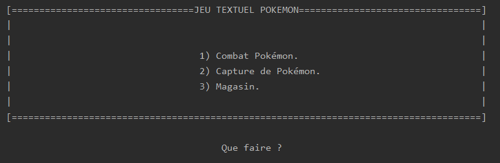

# PokemonText

## Introduction
	
L'application "Pokémon Text" se rapproche de l'expérience des jeux Pokémons via des fonctionnalités bien connues mais sans l'aspect graphique. 
A partir du menu, il est possible de Combattre des Pokémons, les capturer ou encore acheter des objets à la boutique :




## Liens

Lien du projet : https://github.com/gptoto/Python_PokemonText

Téléchargement disponible via clonage HTTPS : https://github.com/gptoto/Python_PokemonText.git


## Get Started (guide de démarrage)

Le jeu peut se lancer si Python est déjà installé sur votre machine et si ce dernier est ajouté aux variables d'environnement :


Lancement du jeu (dans le dossier du projet): 
```
py main.py
```

## Configuration avancée

> L'application fonctionne sans lien avec une base.

> Ne pas oublier d'importer la bibliothèque relative aux saisies clavier : 
```
Import Keyboard
```

## Extension


## Crédits

https://github.com/gptoto
